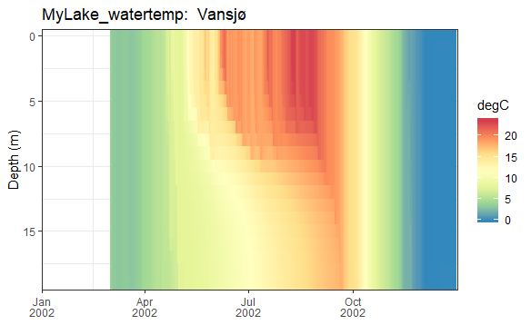

# MyLakeR
My Lake initial implementation in R

## Installation
```{r gh-installation, eval = FALSE}
# install.packages("devtools")
devtools::install_github("aemon-j/MyLakeR")
library(MyLakeR)
```

## Example:  Lake Vansjø (Norway)
```{r gh-installation, eval = FALSE}
mylake_path <- system.file(package="MyLakeR")

# configure some lake parameters from .yaml file into format required by MyLake
config_mylake(config_file="Vansjo_master_config.yaml",
              folder=file.path(mylake_path,"extdata","example"))

# create meteorological file from standardized met input into format required by MyLake
meteo_mylake(meteo_file="LakeEnsemblR_meteo_standard.csv",
             folder=file.path(mylake_path,"extdata","example"))
             
# config file already created for Vansjø in correct format
# located in ".../extdata/example/MyLake/mylake_config_final.Rdata"

# create initial profile file from standardized initial conditions into format required by MyLake
init_mylake(wtemp_file="LakeEnsemblR_wtemp_profile_standard.csv",
            date="2002-03-02 0:00",
            folder=file.path(mylake_path,"extdata","example"))

# run MyLake model from 2002-03-02 to 2002-12-31
run_mylake(sim_folder=file.path(mylake_path,"extdata","example"))
```

## Post-Processing:  Modelled Water Temperature
```{r gh-installation, eval = FALSE}
# load libraries for processing
library(tidyverse)
library(lubridate)

# load output file with model results
load(file.path(mylake_path,"extdata","example","MyLake","output","output.RData"))

# extract depth, water temperature, and dates (daily) from model output
depths <- res$zz
temps <- res$Tzt
dates <- mdy(res$tt)
colnames(temps) <- dates

# combine into single data frame for ggplot
temp_data <- as.data.frame(temps) %>%
  mutate(depths=depths) %>%
  gather(key=date, value=temp_C, 1:(ncol(.)-1)) %>%
  mutate(date=as.Date(as.numeric(date),origin="1970-01-01"))

# heat-map plot of modelled water temperature
ggplot() +
  geom_tile(data=temp_data,aes(x=date,y=depths,fill=temp_C)) +
  scale_y_reverse(expand=c(0,0)) +
  scale_x_date(expand=c(0,0), limits=c(ymd("2002-01-01"),ymd("2002-12-31")), date_labels="%b\n%Y") +
  scale_fill_distiller(palette="Spectral",name="degC") +
  labs(x=NULL,y="Depth (m)",title="MyLake_watertemp:  Vansjø") +
  theme_bw()
```

<!-- -->
